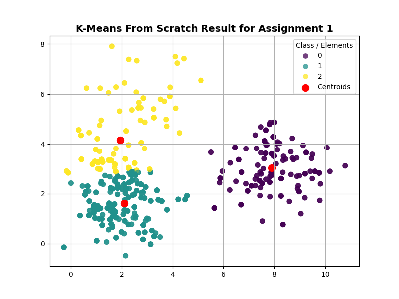
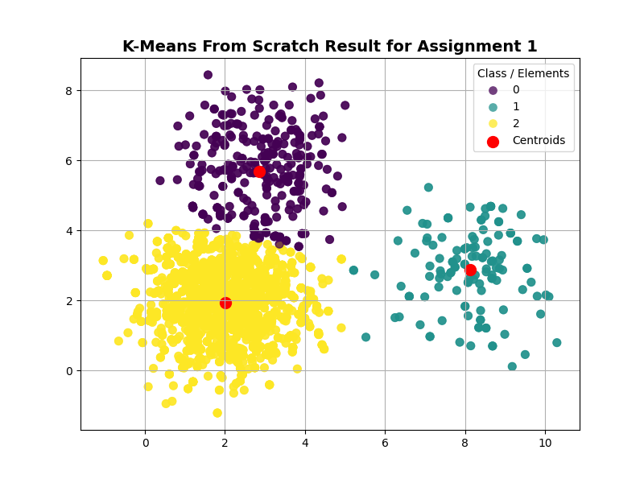
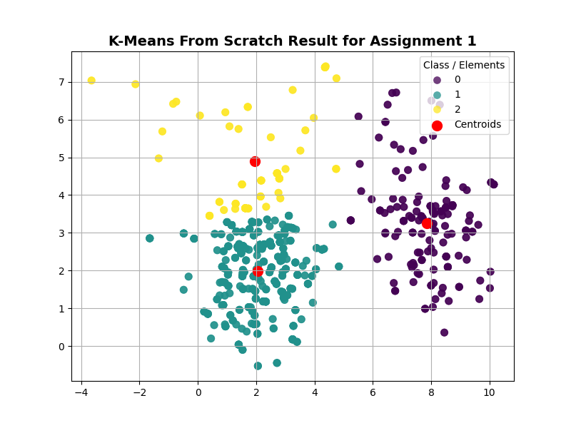

# Báo cáo Lab05: Xây dựng thuật toán K-means Clustering

---

## 1. Giới thiệu

Trong bài thực hành này, tôi sẽ tập trung triển khai giải thuật học không giám sát `KMeanClustering` bằng thư viện `Numpy`. Qua đó, tiến hành thử nghiệm mô hình trên 3 kịch bản phân phối dữ liệu khác nhau để đánh giá điểm mạnh và các giới hạn cố hữu (Limitation) của thuật toán K-Means truyền thống.

## 2. Cấu trúc thư mục

```
\Lab05
|
├─ assignment                       # Chứa các module xử lý chính
│  ├─ assigment_01.py               # Chạy kịch bản lý tưởng
│  ├─ assigment_02.py               # Chạy kịch bản độ lệch kích thước cụm
│  ├─ assigment_03.py               # Chạy kịch bản hình dạng và độ lệch phương sai
│  └─ model.py                      # Mô hình K-means chính
|
├─ results                          # Hình ảnh kết quả khi chạy K-means
│  ├─ Result_assignment_01.png
│  ├─ Result_assignment_02.png
│  └─ Result_assignment_03.png
├─ report.md                        # Báo cáo thực hành
└─ main.py                          # Luồng thực thi chính
```

**Cách vận hành:**

```bash
cd Lab05
python main.py
```

## 3. Phân tích Logic Code thuật toán

Mô hình tự xây dựng bao gồm hai giai đoạn lặp đi lặp lại:

1. **Khởi tạo:** Chọn ngẫu nhiên $K$ điểm dữ liệu trong tập dữ liệu ban đầu để làm các centroid (tâm cụm) sơ khởi thông qua việc xáo trộn `random.shuffle(X)`.

2. **Vòng lặp tối ưu:**

- **E-Step (Expectation):** Hàm `euclidean(a)` tính toán **Khoảng cách hình học Euclid (Euclidean Distance)** từ điểm dữ liệu $a$ đến toàn bộ các centroid hiện tại bằng công thức:

$$d(a, c) = \sqrt{\sum_{i=1}^{d} (a_i - c_i)^2}$$

Điểm dữ liệu được gán vào cụm có khoảng cách ngắn nhất (`np.argmin`).

- **M-Step (Maximization):** Cập nhật lại vị trí centroid bằng cách lấy giá trị trung bình cộng tọa độ (`mean(axis=0)`) của tất cả các điểm được gán vào cụm đó.

3. **Điều kiện dừng:** Thuật toán dừng khi vị trí các tâm cụm không còn thay đổi đáng kể (sự dịch chuyển nhỏ hơn ngưỡng `tolerance = 10e-4`) hoặc đạt số vòng lặp tối đa `max_iters`.

---

## 4. Thực nghiệm và Phân tích kết quả từng Assignment

Dữ liệu mô phỏng trong cả 3 bài tập đều sử dụng phân phối chuẩn đa biến (`np.random.multivariate_normal`) với các tâm thực tế (Ground Truth Means) cố định tại: $\mu_1 = [2, 2]$, $\mu_2 = [8, 3]$, và $\mu_3 = [3, 6]$. Tuy nhiên, sự khác biệt về kích thước mẫu và ma trận hiệp phương sai giữa các bài đã tạo ra những kết quả rất khác nhau.

### 4.1. Assignment 01: Kịch bản Lý tưởng

- **Đặc điểm dữ liệu:** Cả 3 cụm có số lượng mẫu bằng nhau (200 mẫu/cụm) và có chung một ma trận hiệp phương sai đồng nhất $\Sigma = \begin{bmatrix} 1 & 0 \\ 0 & 1 \end{bmatrix}$ (các cụm có dạng hình tròn hoàn hảo).
<p align="middle">
  
</p>

- **Phân tích kết quả trực quan (`Result_assignment_01.png`):**
  - Thuật toán nhận diện hoàn hảo cấu trúc dữ liệu.
  - Ba tâm cụm (màu đỏ) nằm chính xác tại trọng tâm của 3 đám mây điểm dữ liệu. Do các cụm có mật độ đồng đều và tách rời nhau về mặt không gian địa lý, khoảng cách hình học Euclid hoạt động vô cùng hiệu quả. Đây chính là môi trường hoạt động lý tưởng nhất của K-Means.

### 4.2. Assignment 02: Thách thức về độ lệch kích thước cụm

- **Đặc điểm dữ liệu:** Ma trận hiệp phương sai vẫn là hình tròn đồng nhất, nhưng kích thước các cụm bị lệch nghiêm trọng: Cụm 1 có 1200 mẫu, Cụm 2 chỉ có 200 mẫu, Cụm 3 có 1000 mẫu.

<p align="middle">
  
</p>

- **Phân tích lỗi thuật toán từ hình ảnh (`Result_assignment_02.png`):**
  - **Hiện tượng:** K-Means đã phân cụm sai lệch hoàn toàn. Một lượng lớn dữ liệu thuộc cụm khổng lồ phía bên trái (màu tím và màu vàng) đã lấn át và "hút" các tâm cụm về phía mình. Đáng chú ý nhất, cụm nhỏ biệt lập bên phải (chỉ có 200 điểm) đáng lẽ phải là 1 cụm riêng biệt thì lại bị gộp chung màu (màu xanh teal) với cụm phía trên.
  - **Nguyên nhân cốt lõi:** K-Means cố gắng tối ưu hóa việc giảm tổng bình phương khoảng cách trong toàn bộ tập dữ liệu (Inertia). Các cụm quá dày đặc dữ liệu sẽ tạo ra "lực hút trọng lực" lớn đối với các centroid, kéo các tâm cụm về phía khu vực nhiều điểm để giảm tổng khoảng cách toàn cục, dẫn đến việc hy sinh tính chính xác ở các cụm có kích thước nhỏ.

### 4.3. Assignment 03: Thách thức về hình dạng và độ lệch phương sai

- **Đặc điểm dữ liệu:** Các cụm có số lượng mẫu bằng nhau (200 mẫu), nhưng Cụm 3 (tại vị trí $[3, 6]$) có ma trận hiệp phương sai bị kéo giãn theo chiều ngang: $\Sigma_3 = \begin{bmatrix} 10 & 0 \\ 0 & 1 \end{bmatrix}$.
  <p align="middle">
    
  </p>

- **Phân tích lỗi thuật toán từ hình ảnh (`Result_assignment_03.png`):**
  - **Hiện tượng:** Cụm 3 dẹt ngang (đáng lẽ phải là một dải dài nằm ngang đơn nhất) đã bị K-Means cắt làm đôi. Nửa bên phải của nó bị gom vào cụm màu xanh, nửa bên trái bị gom vào cụm màu tím. Tâm cụm màu đỏ phía trên bị đẩy vào khoảng không trung thay vì nằm ở lõi phân phối dữ liệu thực tế.
  - **Nguyên nhân cốt lõi:** Bản chất của khoảng cách Euclid là giả định các cụm luôn có **dạng hình cầu (spherical)**. Khi một cụm có xu hướng kéo dài (hình Elip phẳng), những điểm nằm xa ở rìa cánh của Elip sẽ có khoảng cách hình học ngắn hơn tới tâm cụm lân cận (hình tròn) so với tâm thực sự của nó. Do đó, K-Means bất lực trong việc xử lý các cụm dữ liệu có dạng hình học phức tạp hoặc có phương sai bất đối xứng.

---

## 5. Đánh giá và Đề xuất cải tiến tổng thể

### 5.1. Kết luận về Giới hạn của K-Means truyền thống

Qua ba bài tập, chúng ta chứng minh được K-Means bộc lộ rõ rệt 3 nhược điểm lớn:

1. **Nhạy cảm với kích thước mẫu (Imbalanced Data):** Xu hướng ưu tiên các cụm lớn và bỏ qua/gộp sai các cụm nhỏ.
2. **Chỉ giả định dạng hình học elip tròn (Spherical Assumption):** Thất bại hoàn toàn trước dữ liệu có phương sai kéo giãn hoặc hình học phức tạp.
3. **Nhạy cảm với khởi tạo ngẫu nhiên:** Hàm `random.shuffle(X)` chọn ngẫu nhiên các điểm đầu tiên có thể dẫn đến việc mô hình rơi vào bẫy tối ưu cục bộ (Local Minima) nếu các điểm khởi tạo nằm quá sát nhau.

### 5.2. Đề xuất Giải pháp Kỹ thuật nâng cao

Để khắc phục triệt để các bài toán phân cụm phức tạp như Assignment 02 và 03, các giải pháp thay thế hiệu quả bao gồm:

- **Giải pháp 1: Thay thế bằng Gaussian Mixture Models (GMM) + EM**
  - _Áp dụng cho Assignment 03:_ Thay thế khoảng cách Euclid cứng nhắc bằng phân cụm mềm (xác suất) dựa trên ma trận hiệp phương sai. Cơ chế này cho phép biên phân cụm tự do co giãn thành hình Elip theo mọi hướng, giải quyết triệt để bài toán cụm bị kéo giãn hoặc biến động phương sai.

- **Giải pháp 2: Sử dụng thuật toán mật độ DBSCAN**
  - _Áp dụng cho Assignment 02:_ Gom cụm dựa trên mật độ vùng lân cận thay vì khoảng cách tới tâm. Phương pháp này giúp nhận diện chính xác các cụm có kích thước chênh lệch cực lớn hoặc có hình dáng dị biệt mà không bị ảnh hưởng bởi "lực hút" của các cụm đông dữ liệu.

- **Giải pháp 3: Nâng cấp thuật toán khởi tạo K-Means++**
  - _Cải tiến mã nguồn:_ Sửa đổi logic chọn centroid ban đầu trong hàm `fit()`. Thay vì xáo trộn ngẫu nhiên, tâm cụm tiếp theo sẽ được chọn dựa trên xác suất tỷ lệ thuận với bình phương khoảng cách tới các tâm đã có. Điều này giúp các centroid khởi tạo phân tán đều, tránh bẫy tối ưu cục bộ (Local Minima).
